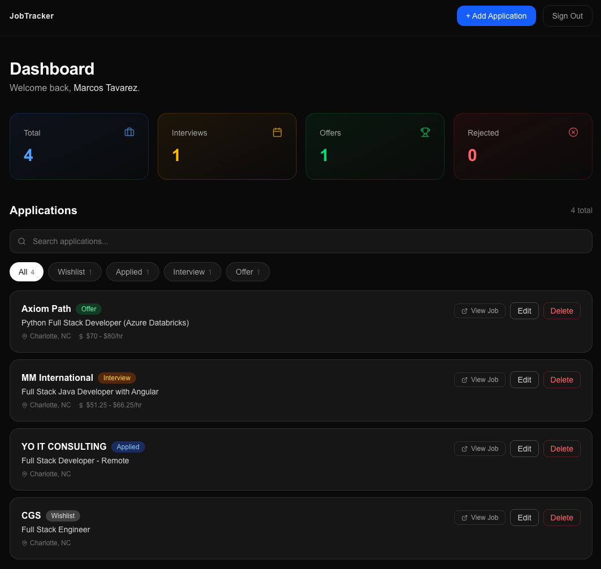
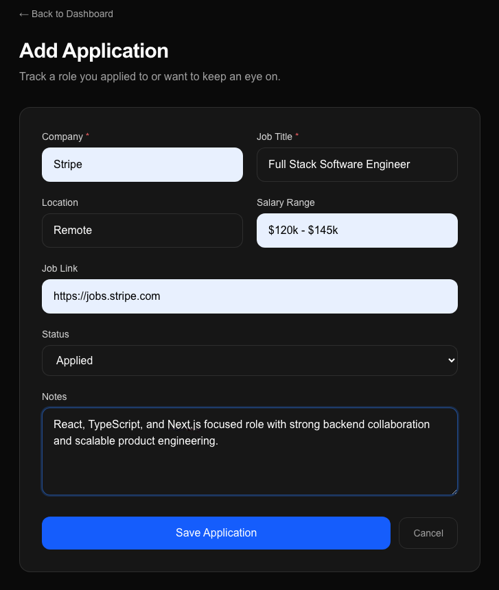
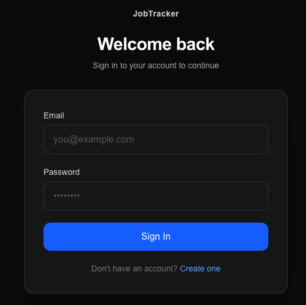
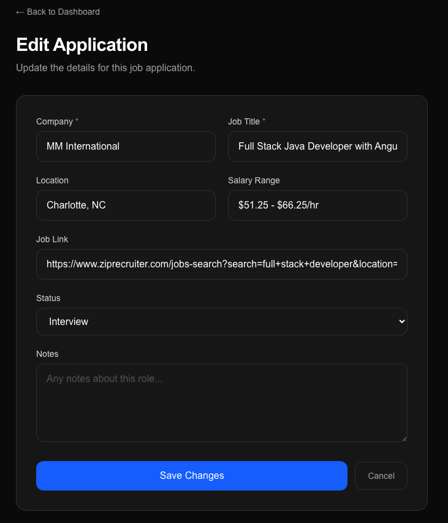

# Job Tracker SaaS

**Production-ready SaaS platform for tracking job applications, interviews, and offers — built with Next.js 16, TypeScript, Prisma, and NextAuth.**

[](https://job-tracker-sigma-six.vercel.app)
[](https://github.com/Mtavarez0625/job-tracker)
[](https://nextjs.org)
[](https://www.typescriptlang.org)
[](LICENSE)

---

## Overview

Job Tracker is a full-stack SaaS application that centralizes your entire job search pipeline in one secure workspace. Manage applications, track interview stages, log offers, and search your history — all backed by a PostgreSQL database with session-based authentication.

Built to demonstrate real-world full-stack skills: protected routes, server-side data fetching, optimistic UI updates, CRUD APIs, and a modern enterprise-grade user experience.

---

## Screenshots

### Dashboard


### Add Application


### Login


### Edit Application


---

## Features

- **Secure Authentication** — NextAuth session-based login with protected routes and user-scoped data access
- **Full CRUD** — Create, read, update, and delete job applications with server-side validation
- **Status Tracking** — Track each application through stages: Wishlist → Applied → Interview → Offer → Rejected
- **Search & Filtering** — Debounced search and status filtering across all applications
- **Optimistic UI Updates** — Instant feedback on mutations before server confirmation
- **Toast Notifications** — Real-time success/error feedback on all user actions
- **Responsive Dashboard** — Mobile-first SaaS layout with a polished dark aesthetic
- **Protected API Routes** — All API endpoints require an authenticated session
- **PostgreSQL Persistence** — Reliable relational data storage via Prisma ORM and Neon

---

## Tech Stack

| Category | Technology |
|---|---|
| Framework | Next.js 16 (App Router) |
| Language | TypeScript |
| UI Library | React 19 |
| Styling | Tailwind CSS |
| ORM | Prisma |
| Database | PostgreSQL (Neon) |
| Auth | NextAuth.js |
| Deployment | Vercel |

---

## Architecture Highlights

- **Next.js App Router** — Server components for data fetching, client components for interactivity
- **Prisma ORM** — Type-safe database access with schema-first modeling connected to Neon PostgreSQL
- **NextAuth Session Management** — Credential-based authentication with JWT sessions and protected middleware
- **Protected API Routes** — Every API endpoint validates the session before processing requests
- **Optimistic Updates** — Local state updated immediately; server state synced in the background
- **Modular Components** — Reusable UI components with consistent design tokens and props

---

## Getting Started

### Prerequisites

- Node.js 18+
- A PostgreSQL database (Neon recommended)

### Install dependencies

```bash
npm install
```

### Set up environment variables

Copy the example file and fill in your values:

```bash
cp .env.example .env.local
```

### Push database schema

```bash
npx prisma db push
```

### Run the development server

```bash
npm run dev
```

Open [http://localhost:3000](http://localhost:3000) in your browser.

---

## Environment Variables

```env
DATABASE_URL=            # PostgreSQL connection string (Neon pooled URL)
DIRECT_DATABASE_URL=     # Direct database URL for Prisma migrations
NEXTAUTH_SECRET=         # Random secret for NextAuth JWT signing
NEXTAUTH_URL=            # Full URL of your deployment (e.g. http://localhost:3000)
```

---

## Production Build

```bash
npm run build
npm start
```

Prisma client is generated automatically during the build step via `prisma generate`.

---

## Deployment Notes

This project is deployed on **Vercel** with the following configuration:

- Environment variables set in the Vercel project dashboard
- `prisma generate` runs as part of the build command
- Neon PostgreSQL provides a serverless-compatible connection pool
- `NEXTAUTH_URL` set to the production domain for session handling

---

## What I Learned

- Structuring a Next.js App Router project with mixed server/client components for optimal performance
- Implementing session-based authentication with NextAuth and protecting routes at both the middleware and API level
- Writing type-safe database queries with Prisma and connecting to a serverless PostgreSQL provider (Neon)
- Designing optimistic UI patterns that feel instant while maintaining data consistency
- Building a responsive SaaS dashboard with Tailwind CSS that works across all device sizes
- Configuring a production deployment on Vercel with secured environment variables and automatic Prisma generation

---

## Author

**Marcos Tavarez** — Full-Stack Developer

- Portfolio: [marcostavarez.com](https://marcostavarez.com)
- GitHub: [github.com/Mtavarez0625](https://github.com/Mtavarez0625)
- LinkedIn: [linkedin.com/in/marcos-tavarez](https://www.linkedin.com/in/marcos-tavarez/)

---

## License

This project is licensed under the [MIT License](LICENSE).
